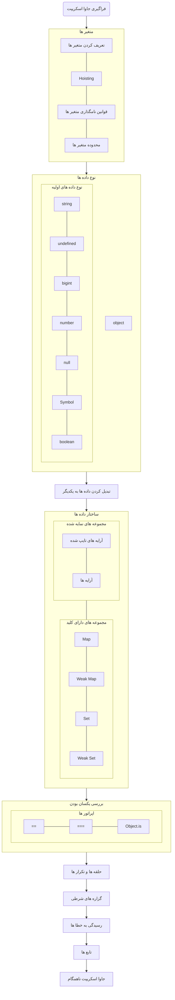

```mermaid
flowchart TB
start("فراگیری جاوا اسکریپت")-->variables
subgraph variables["متغیر ها"]
direction TB
declaring-variables["تعریف کردن متغیر ها"]---hoisting["Hoisting"]---variable-naming-rules["قوانین نامگذاری متغیر ها"]---variable-scopes["محدوده متغیر ها"]
end
variables-->data-types

subgraph data-types["نوع داده ها"]
direction TB;
subgraph primitive-types["نوع داده های اولیه"]
direction TB;
string---undefined---bigint---number---null---Symbol---boolean
end
object
end

data-types-->type-conversion["تبدیل کردن داده ها به یکدیگر"]-->data-structures
subgraph data-structures["ساختار داده ها"]
direction TB;
    subgraph indexed-collections["مجموعه های نمایه شده"]
    direction TB;
    typed-arrays["آرایه های تایپ شده"]---arrays["آرایه ها"]
    end
    indexed-collections---keyed-collections
     subgraph keyed-collections["مجموعه های دارای کلید"]
    direction TB;
    map-js["Map"]---weak-map["Weak Map"]---set["Set"]---weak-set["Weak Set"]
    end
end
data-structures-->equality
subgraph equality["بررسی یکسان بودن"]
direction TB;
subgraph equality-operators["اپراتور ها"]
equal-operator["=="]---strict-equal-operator["==="]---is-object["Object.is"]
end
end
equality-->loops-and-iterations["حلقه ها و تکرار ها"]-->conditional-statements["گزاره های شرطی"]-->exception-handling["رسیدگی به خطا ها"]-->functions["تابع ها"]-->async["جاوا اسکریپت ناهمگام"]
```
