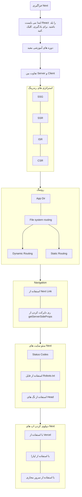

```mermaid
flowchart TB;
start(فراگیری Next)-->react["ابتدا می بایست React را بلد باشید. برای یادگیری، کلیک کنید."];
react-->courses["دوره های آموزشی مفید"]--->server-and-client-difference["تفاوت بین Server و Client"]-->strategies;
subgraph strategies["استراتژی های رندرینگ"]
direction TB
ssg[SSG]---ssr[SSR]---isr[ISR]---csr[CSR]
end
subgraph routing["روتینگ"]
direction TB
app-dir["App Dir"]---file-system-routing["File system routing"]--->dynamic-route["Dynamic Routing"]
file-system-routing--->static-route["Static Routing"]
end
strategies--->routing
routing--->navigation
subgraph navigation["Navigation"]
direction TB
next-link["استفاده از Next Link"]---server-side-navigation["ری دایرکت کردن از getServerSideProps"]
end
navigation--->seo
subgraph seo["سئو سایت های Next"]
direction TB
status-codes["Status Codes"]---robots-txt["استفاده از فایل Robots.txt"]---head-tags["استفاده از تگ های Head"]
end
seo--->deploy
subgraph deploy["دیپلوی کردن اپ های Next"]
direction TB
vercel["با استفاده از Vercel"]---liara["با استفاده از لیارا"]---vps["با استفاده از سرور مجازی"]
end
click react href "/roadmap/web-development/react"
```
