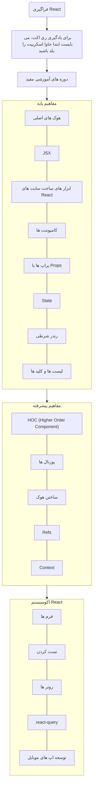

```mermaid
flowchart TB;
start(فراگیری React)-->javascript["برای یادگیری ری اکت، می بایست ابتدا جاوا اسکریپت را بلد باشید."];
javascript-->courses["دوره های آموزشی مفید"]-->fundamentals;
subgraph fundamentals["مفاهیم پایه"]
direction TB
basic-hooks["هوک های اصلی"]---jsx["JSX"]---creation["ابزار های ساخت سایت های React"]---components["کامپوننت ها"]---props["پراپ ها یا Props"]---state["State"]---conditional-rendering["رندر شرطی"]---lists-and-keys["لیست ها و کلید ها"]
end
fundamentals-->advanced;
subgraph advanced["مفاهیم پیشرفته"]
direction TB
hoc["HOC (Higher Order Component)"]---portals["پورتال ها"]---writing-your-hook["ساختن هوک"]---refs["Refs"]---context["Context"]
end
advanced-->ecosystem
subgraph ecosystem["اکوسیستم React"]
direction TB
forms["فرم ها"]---testing["تست کردن"]---routers["روتر ها"]---react-query["react-query"]---mobile["توسعه اپ های موبایل"]
end
```
