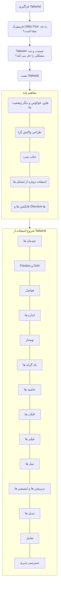

```mermaid
flowchart TB
start("فراگیری Tailwind")-->what-is-utility-first("فریمورک Utility First به چه معنا است؟")-->what-problem-does-tailwind-solve("Tailwind چیست و چه مشکلی را حل می کند؟")-->installation("نصب Tailwind")-->fundamentals

subgraph fundamentals["مفاهیم پایه"]
direction TB
hover-focus-and-other-states("هاور، فوکوس و دیگر وضعیت ها")---responsive-design("طراحی واکنش گرا")---dark-mode("حالت شب")---reusing-styles("استفاده دوباره از استایل ها")---functions-and-directives("فانکشن ها و Directive ها")
end

fundamentals-->getting-started

subgraph getting-started["شروع استفاده از Tailwind"]
direction TB
layouts["چیدمان ها"]---flexbox-and-grid["Flexbox و Grid"]---spacing["فواصل"]---sizing["اندازه ها"]---typography["نوشتار"]---backgrounds["بک گراند ها"]---borders["حاشیه ها"]---effects["افکت ها"]---filters["فیلتر ها"]---tables["تیبل ها"]---transitions-and-animations["ترنزیشن ها و انیمیشن ها"]---transforms["تبدیل ها"]---interactivity["تعامل"]---accessibility["دسترسی پذیری"]
end

```
